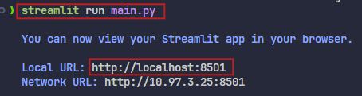

# Google Cloud Asset Inventory Search PoC

- `Python3`과 `Google Cloud Asset Inventory`의 필터 기능을 사용하여, 특정 프로젝트를 나열   
- `Streamlit`을 사용하여 결과를 대시보드로 제공

## 사용 방법

### Google Cloud 프로젝트 설정:
- Google Cloud 콘솔에서 내 `Organization` 선택

### API 사용 설정:
- Google Cloud 콘솔에서 `APIs & Services` -> `Library`로 이동
- `Cloud Asset API`를 검색하고 `Enable`을 클릭  


### 필요한 패키지 설치:
- 터미널 또는 명령 프롬프트를 열기
- 다음 명령어를 실행하여 필요한 Python 패키지를 설치
```bash
pip install google-cloud-asset streamlit
```
- 또는, `requirements.txt`를 통하여 설치
```bash
pip install -r requirements.txt
```

### 애플리케이션 기본 사용자 인증(ADC) 설정:
- gcloud 명령줄 도구를 사용하여 애플리케이션 기본 사용자 인증을 설정
- 이를 통해 해당 프로젝트의 애플리케이션이 Google Cloud 리소스에 액세스할 수 있도록 허용
```bash
gcloud auth application-default login
````

### `main.py` 실행:
터미널 또는 명령 프롬프트에서 다음 명령어를 실행
```bash
streamlit run main.py
```

### 웹 브라우저에서 접속:
- `Streamlit` 명령어 실행 후 표시되는 URL(e.g., http://localhost:8501)로 웹 브라우저를 통해 접속



### 정보 입력:
- `Organization ID` 필드에 Organization ID를 입력
- `Query` 필드에 검색어를 입력
    - `displayName` 필터를 사용하여 프로젝트 이름으로 검색 가능
        - (e.g., ***`displayName:My*Project*`***)   


> *더 자세한 검색 옵션은 [Cloud Asset Inventory query language](https://cloud.google.com/asset-inventory/docs/search-query-syntax)를 참조*

### 새로고침:
`Refresh` 버튼을 클릭하여 검색을 실행

### 결과 확인:
- 검색 결과는 표 형태로 표시
- 각 프로젝트의 이름, 설명, 상태, 생성 시간, 수정 시간 등을 확인할 수 있다


### 코드 설명
- `search_resources` 함수: Google Cloud Asset Inventory API를 사용하여 프로젝트를 필터링 및 검색
    - 검색 결과는 리스트 형태로 반환
- Streamlit: 사용자 인터페이스를 제공
    - Organization ID, 검색어 입력 필드와 결과 테이블을 표시
- `create_time`, `update_time`은 한국 표준시(KST)로 변환하여 표시
- `response.additional_attributes["projectId"]`를 통해 각 프로젝트의 ID를 가져올 수 있음